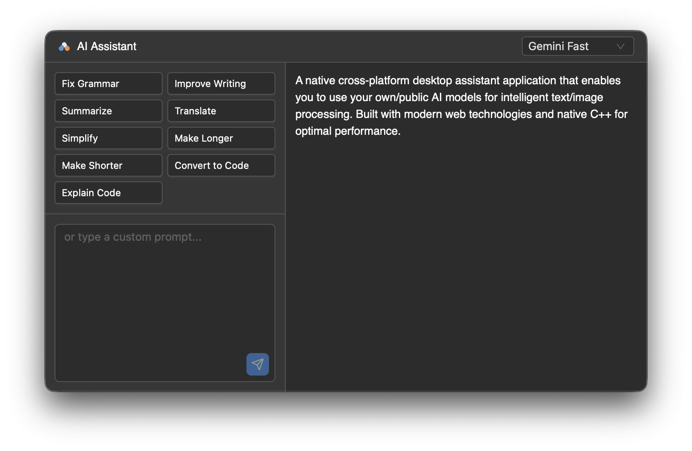
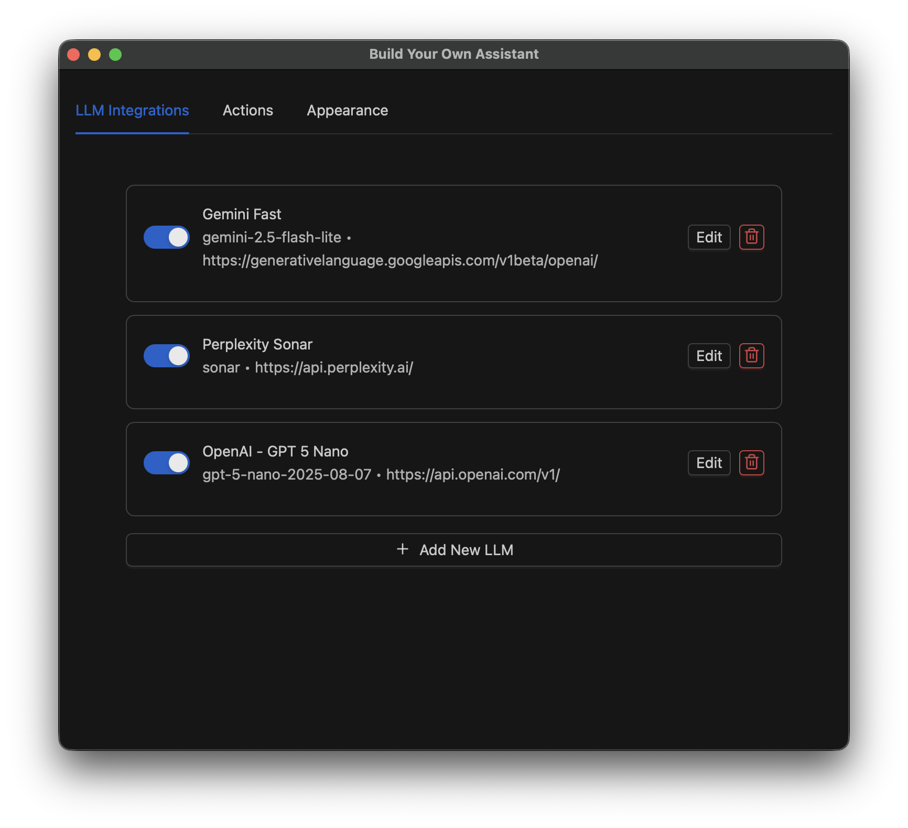

# BYOA (Build Your Own Assistant)

A native cross-platform desktop assistant application that enables you to use your own/public AI models for intelligent text/image processing. Built with modern web technologies and native C++ for optimal performance.

## Features

- **Multi-LLM Support**: Configure and use multiple AI models simultaneously (OpenAI, Claude, local models, etc.)
- **Smart Text Processing**: Process clipboard content with AI-powered actions (grammar correction, translation, summarization, etc.)
- **Custom Actions**: Create and configure your own quick actions with custom prompts
- **Clipboard Integration**: Seamless integration with macOS clipboard for instant text processing
- **Native Performance**: C++23 backend with Saucer webview for optimal performance
- **Modern Web UI**: React 18 with TypeScript, Ant Design, and Vite
- **Secure Credential Storage**: Uses macOS Keychain for secure API key storage
- **System Menubar Integration**: Quick access from the macOS menu bar
- **Theme Support**: Light, dark, and auto themes

## Architecture

This application consists of two main components:

### Native Backend (`src/native`)
- **Language**: C++23
- **Platform**: macOS (13.3+)
- **Build System**: CMake 3.16+
- **Key Libraries**:
  - [Saucer](https://github.com/saucer/saucer) - Modern C++ webview wrapper
  - [spdlog](https://github.com/gabime/spdlog) - Fast C++ logging library
  - [keychain](https://github.com/hrantzsch/keychain) - Secure credential storage
  - [nlohmann/json](https://github.com/nlohmann/json) - JSON parsing
  - [CPR](https://github.com/libcpr/cpr) - HTTP requests
- **Key Components**:
  - Application and menubar controller
  - Window management and webview hosting
  - System integration (clipboard, shortcuts)
  - Secure vault for API keys and configuration
  - HTTP client for LLM API requests

### Web Frontend (`src/web`)
- **Framework**: React 18
- **Language**: TypeScript
- **Build Tool**: Vite 6.3
- **UI Library**: Ant Design 5
- **Key Components**:
  - Assistant popup for AI interactions
  - Settings dialog for LLM and action configuration
  - Clipboard data processing
  - Menubar entry for quick access

## Getting Started

### Prerequisites

- **macOS** 13.3 (Ventura) or later
- **Node.js** >= 16.0.0
- **yarn**
- **CMake** >= 3.16
- **Xcode Command Line Tools** (includes C++23 compiler)
  ```bash
  xcode-select --install
  ```

### Installation

1. **Clone the repository**
   ```bash
   git clone https://github.com/shmmsra/byoa.git
   cd byoa
   ```

2. **Install JavaScript dependencies**
   ```bash
   yarn install
   ```

3. **Build the web frontend**
   ```bash
   yarn build
   ```

4. **Configure and build the native application**
   ```bash
   yarn cmake:configure
   yarn cmake:build
   ```

5. **Run the application**
   
   The built application will be located at:
   ```
   build/Debug/ai_assistant.app
   ```
   
   You can open it from Finder or via command line:
   ```bash
   open build/Debug/ai_assistant.app
   ```

### First-Time Setup

1. **Launch the application** - A menubar icon will appear
2. **Configure LLM Settings** - Click the menubar icon and select "Settings"
3. **Add AI Model Configuration**:
   - Click "Add LLM Config"
   - Enter a name (e.g., "OpenAI GPT-4")
   - Enter the model name (e.g., "gpt-4")
   - Enter the base URL (e.g., "https://api.openai.com/v1")
   - Enter your API key (stored securely in macOS Keychain)
   - Enable the configuration
4. **Configure Quick Actions** - Customize or add actions in the Actions tab
5. **Set Keyboard Shortcut** - Configure global shortcut to trigger the assistant

## Development

### Frontend Development

Start the Vite development server with hot reloading:
```bash
yarn dev
```

This will start a development server at `http://localhost:3000` where you can preview the web UI independently.

### Native Development

#### Building Debug Version
```bash
yarn cmake:configure
yarn cmake:debug
```

#### Building Release Version
```bash
yarn cmake:configure
yarn cmake:release
```

#### Cleaning Build
```bash
yarn cmake:clean
# To completely rebuild
rm -rf build
yarn cmake:configure
yarn cmake:build
```

### Code Quality

Lint TypeScript/React code:
```bash
yarn lint
yarn lint:fix
```

Format code:
```bash
yarn format
```

## Project Structure

```
├── src/
│   ├── native/              # C++ native backend
│   │   ├── include/         # Header files
│   │   ├── source/          # Implementation files
│   │   │   ├── xplat/       # Cross-platform code
│   │   │   ├── mac/         # macOS-specific code (.mm)
│   │   │   └── win/         # Windows-specific code (.cpp)
│   │   └── resource/        # Platform resources
│   │       └── mac/         # macOS resources (icons, plist)
│   └── web/                 # React web frontend
│       ├── components/      # React components
│       ├── stores/          # State management
│       ├── utils/           # Utility functions
│       ├── styles/          # CSS stylesheets
├── build/                   # Build output directory
│   ├── Resources/           # Built web assets
│   └── Debug/               # Debug build
│       └── ai_assistant.app # macOS application bundle
├── CMakeLists.txt          # CMake configuration
├── vite.config.ts          # Vite build configuration
├── package.json            # Node.js dependencies and scripts
└── README.md               # This file
```

## Usage

### Triggering the Assistant

1. **Keyboard Shortcut**: Use your configured global shortcut (default can be set in Settings)
2. **Menubar**: Click the menubar icon and select "Show Assistant"

### Working with Clipboard Content

1. Copy text to your clipboard
2. Trigger the assistant
3. The clipboard content will automatically appear in the right panel
4. Select a quick action or enter a custom prompt
5. Click the result to copy it back to clipboard

### Creating Custom Actions

Custom actions support the `{{data}}` placeholder:

```
Example Action: "Translate to Spanish"
Prompt: "Translate the following text to Spanish:\n\n{{data}}"
```

The `{{data}}` will be replaced with your clipboard content.

### Using Multiple LLMs

1. Configure multiple LLM providers in Settings
2. In the assistant popup, select "All LLMs" from the dropdown
3. See responses from all enabled LLMs side-by-side

## Screenshots

### Assistant Popup

*AI-powered text processing with multiple LLM support and quick actions*

### Settings Dialog

*Configure multiple LLM providers and custom actions*

## Building for Production

### Complete Production Build

```bash
# Build web frontend for production
yarn build

# Configure CMake for Release
cmake -B build -S . -DCMAKE_BUILD_TYPE=Release

# Build native application
cmake --build build --config Release
```

The production application will be at:
```
build/Release/ai_assistant.app
```

### Code Signing (for Distribution)

To distribute the app outside the App Store, you'll need to sign it:

```bash
codesign --force --deep --sign "Developer ID Application: Your Name" \
  build/Release/ai_assistant.app
```

### Creating a DMG

```bash
# Create a disk image for distribution
hdiutil create -volname "BYOA Assistant" -srcfolder build/Release/ai_assistant.app \
  -ov -format UDZO BYOA-Assistant.dmg
```

## Contributing

Contributions are welcome! Here's how to get started:

1. Fork the repository
2. Create a feature branch (`git checkout -b feature/amazing-feature`)
3. Make your changes and test them
4. Commit your changes (`git commit -m 'Add amazing feature'`)
5. Push to the branch (`git push origin feature/amazing-feature`)
6. Open a Pull Request

### Development Guidelines

- Follow the existing code style (use `.clang-format` for C++ code)
- Write clear commit messages
- Test on macOS and WindowsOS before submitting
- Update documentation as needed
- For C++ code, ensure C++23 compatibility

## Troubleshooting

### Common Issues

**Application won't launch**
- Ensure you have macOS 13.3 or later
- Check that Xcode Command Line Tools are installed
- Try rebuilding: `rm -rf build && yarn cmake:configure && yarn cmake:build`

**API Key not working**
- Verify the API key is correct in Settings
- Check the base URL format (should include scheme: `https://`)
- Ensure the model name matches your provider's requirements

**Clipboard content not detected**
- Grant clipboard permissions to the application in System Settings → Privacy & Security
- Try copying text again after the assistant window opens

**Build errors**
- Clear CMake cache: `rm -rf build`
- Ensure all dependencies are installed
- Check that you have enough disk space for the build

## Roadmap

Potential future features:

- [ ] Support for Linux
- [ ] Image processing capabilities
- [ ] Custom keyboard shortcut
- [ ] Action local history

## License

This project is licensed under the MIT License - see the [LICENSE](LICENSE) file for details.

## Acknowledgments

- Built with [Saucer](https://github.com/saucer/saucer) for modern C++ webview integration
- UI powered by [React](https://react.dev/) and [Ant Design](https://ant.design/)
- Fast builds with [Vite](https://vite.dev/)
- Secure credential storage via [keychain](https://github.com/hrantzsch/keychain)
- HTTP client by [CPR](https://github.com/libcpr/cpr)
- Thanks to all open-source contributors who make projects like this possible

## Support

For support, bug reports, or feature requests:
- Open an issue on [GitHub Issues](https://github.com/shmmsra/byoa/issues)
- Check existing issues for solutions to common problems

---

**BYOA** - Build Your Own Assistant for your desktop workflow: no vendor lock-in, full control over your AI models.
